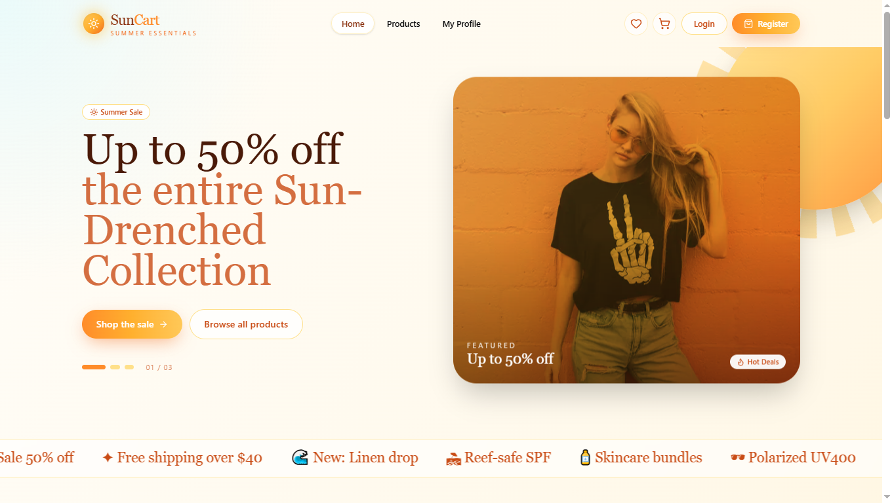
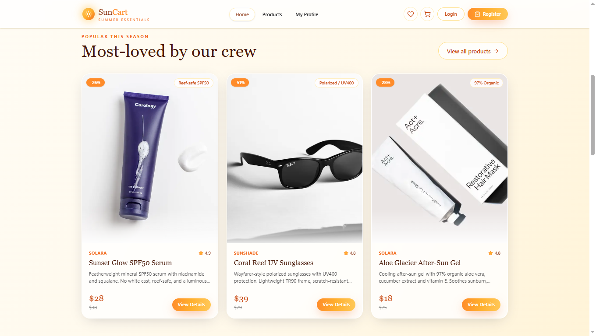
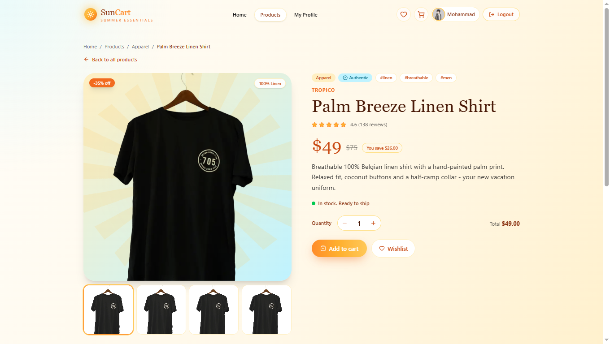

<div align="center">

# ☀️ SunCart

### Summer Essentials E-Commerce Store

A polished Next.js e-commerce application where users can browse curated summer products, view detailed product pages, manage a shopping cart and wishlist with localStorage persistence, create an account, sign in with email or Google, and manage their profile — all wrapped in a sun-kissed, premium UI.

[](https://suncart.vercel.app/)
[](https://nextjs.org/)
[](https://react.dev/)
[](https://tailwindcss.com/)
[](https://www.better-auth.com/)
[](https://suncart.vercel.app/)

</div>

---

## 📸 Preview

<p align="center">
  
</p>

<p align="center">
  
</p>

<p align="center">
  
</p>

> **🔗 Live Site:** [https://suncart.vercel.app/](https://suncart.vercel.app/)

---

## ✨ Features

| Feature                         | Description                                                                        |
| :------------------------------ | :--------------------------------------------------------------------------------- |
| 🛍️ **Product Catalog**          | Browse 12 curated summer products with ratings, prices, discounts, and tags        |
| 🏠 **Dynamic Homepage**         | Hero section, popular products, summer tips, top brands, and limited edition       |
| 🔎 **Product Detail Pages**     | Full product view with image gallery, quantity selector, stock status, and reviews |
| 🛒 **Shopping Cart**            | Add to cart, adjust quantity, remove items, order summary, and checkout            |
| ❤️ **Wishlist**                 | Save products for later, move to cart, and remove — all with localStorage          |
| 🔢 **Live Navbar Badges**       | Real-time cart and wishlist count badges that update instantly                     |
| 🔐 **Better Auth Login**        | Email/password authentication with Google social sign-in support                   |
| 👤 **Protected Profile Page**   | View profile details after sign-in with session-aware navigation                   |
| 📱 **Fully Responsive**         | Mobile-first design with collapsible navbar and adaptive grid layouts              |
| 🌊 **Premium UI Design**        | Sun-kissed gradients, glassmorphism, micro-animations, and wavy footer             |
| 💾 **LocalStorage Persistence** | Cart and wishlist data persists across page refreshes and browser sessions         |
| 🚀 **Vercel Ready**             | Built with the Next.js App Router and prepared for Vercel deployment               |

---

## 🛠️ Tech Stack

<div align="center">

|       Technology       |                        Purpose                        |
| :--------------------: | :---------------------------------------------------: |
|     **Next.js 16**     | App Router, routing, server rendering, and deployment |
|      **React 19**      |            Component-driven user interface            |
|   **Tailwind CSS 4**   |     Utility-first styling and responsive layouts      |
|     **DaisyUI 5**      |        UI component library and theme support         |
|    **Better Auth**     | Authentication, sessions, sign-up, sign-in, and OAuth |
|     **MongoDB 7**      |      Production authentication database storage       |
|  **MongoDB Adapter**   |        Better Auth production database adapter        |
|    **Lucide React**    |       Beautiful and consistent SVG icon library       |
|  **React Hot Toast**   |         Toast notifications for user feedback         |
|    **Lottie React**    |       Animated sun illustration in hero section       |
| **React Fast Marquee** |          Scrolling brand marquee on homepage          |
|       **Vercel**       |                 Production deployment                 |

</div>

---

## 📁 Project Structure

```text
PHA8-SunCart/
├── public/
│   ├── preview1.png
│   ├── preview2.png
│   ├── preview3.png
│   └── *.svg
├── src/
│   ├── app/
│   │   ├── api/auth/[...all]/route.js
│   │   ├── cart/page.jsx
│   │   ├── login/page.jsx
│   │   ├── my-profile/page.jsx
│   │   ├── products/
│   │   │   ├── [id]/page.jsx
│   │   │   └── page.jsx
│   │   ├── register/page.jsx
│   │   ├── wishlist/page.jsx
│   │   ├── globals.css
│   │   ├── layout.jsx
│   │   ├── not-found.jsx
│   │   └── page.jsx
│   ├── components/
│   │   ├── footer/Footer.jsx
│   │   ├── heroSection/
│   │   │   ├── HeroSection.jsx
│   │   │   └── MarqueeHero.jsx
│   │   ├── navbar/Navbar.jsx
│   │   ├── LimitedEdition.jsx
│   │   ├── ProductCard.jsx
│   │   ├── ProductDetailsClient.jsx
│   │   ├── SummerTips.jsx
│   │   └── TopBrands.jsx
│   ├── context/
│   │   └── ShopContext.jsx
│   ├── data/
│   │   ├── products.json
│   │   └── sun-lottie.json
│   └── lib/
│       ├── auth-client.js
│       └── auth.js
├── next.config.mjs
├── package.json
├── tailwind.config.mjs
└── README.md
```

---

## 🎨 Design Highlights

- **Sun-kissed hero section** with animated Lottie sun, gradient overlays, and scrolling brand marquee
- **Product card grid** with hover animations, discount badges, rating stars, and quick-add actions
- **Detailed product pages** with image gallery, quantity controls, stock indicators, and wishlist toggle
- **Shopping cart layout** with quantity adjusters, save-for-later, order summary, and secure checkout CTA
- **Wishlist page** with gradient header, product cards with zoom effects, and move-to-cart buttons
- **Summer Tips section** with icon cards, decorative gradient glows, and formatted tip numbers
- **Dark sunset footer** with wavy SVG divider, newsletter form, social icons, and navigation links
- **Session-aware navbar** with live cart/wishlist badges, user avatar, and responsive mobile menu

---

## 🔌 API Overview

### Internal API

Authentication is handled by Better Auth and mounted under:

```text
/api/auth/[...all]
```

| Endpoint                  | Method     | Purpose                                      |
| :------------------------ | :--------- | :------------------------------------------- |
| `/api/auth/[...all]`      | `GET/POST` | Better Auth session, sign-in, sign-up, OAuth |
| `/api/auth/get-session`   | `GET`      | Fetch the current user session               |
| `/api/auth/sign-up/email` | `POST`     | Create an account with email and password    |
| `/api/auth/sign-in/email` | `POST`     | Sign in with email and password              |

### Product Data

Product data is loaded from a static JSON file:

```text
src/data/products.json
```

| Data File         | Purpose                                                                                                      |
| :---------------- | :----------------------------------------------------------------------------------------------------------- |
| `products.json`   | 12 summer products with name, brand, price, rating, stock, description, image, category, tags, and highlight |
| `sun-lottie.json` | Lottie animation data for the hero section sun illustration                                                  |

### Client-Side Storage

Cart and wishlist use browser `localStorage` with these keys:

| Storage Key        | Purpose                            |
| :----------------- | :--------------------------------- |
| `suncart.cart`     | Shopping cart items and quantities |
| `suncart.wishlist` | Saved wishlist products            |

---

## 🔐 Environment Variables

Create a `.env` file in the project root and configure these values:

```env
# MongoDB Atlas (https://www.mongodb.com/atlas/cluster0)
MONGODB_URI=your_mongodb_connection_string

# Public URL
NEXT_PUBLIC_APP_URL=http://localhost:3000

# Better Auth (https://better-auth.com/)
BETTER_AUTH_SECRET=your_random_secret
BETTER_AUTH_URL=http://localhost:3000

# Google OAuth (https://console.cloud.google.com/apis/credentials)
GOOGLE_REDIRECT_URI=http://localhost:3000/api/auth/callback/google
GOOGLE_CLIENT_ID=your_google_oauth_client_id
GOOGLE_CLIENT_SECRET=your_google_oauth_client_secret
```

For production, set:

```env
BETTER_AUTH_URL=https://suncart.vercel.app
NEXT_PUBLIC_APP_URL=https://suncart.vercel.app
```

---

## 🚀 Getting Started

Install dependencies:

```bash
npm install
```

Run the development server:

```bash
npm run dev
```

Open the app:

```text
http://localhost:3000
```

Build for production:

```bash
npm run build
```

Run the production server:

```bash
npm start
```

Lint the project:

```bash
npm run lint
```

---

## 🌐 Deployment

The application is deployed on **Vercel**:

**Live URL:** [https://suncart.vercel.app/](https://suncart.vercel.app/)

For deployment:

1. Add all production environment variables in Vercel project settings.
2. Set `BETTER_AUTH_URL` to `https://suncart.vercel.app`.
3. Set `NEXT_PUBLIC_APP_URL` to `https://suncart.vercel.app`.
4. Configure Google OAuth authorized origins and redirect URLs for the production domain.
5. Allow Vercel/production access in MongoDB Atlas Network Access.
6. Redeploy after changing environment variables.

---

<div align="center">

**⭐ If you found this project useful, consider giving it a star!**

Made using Next.js, React, Tailwind CSS, DaisyUI, Better Auth, MongoDB, and Vercel

</div>
